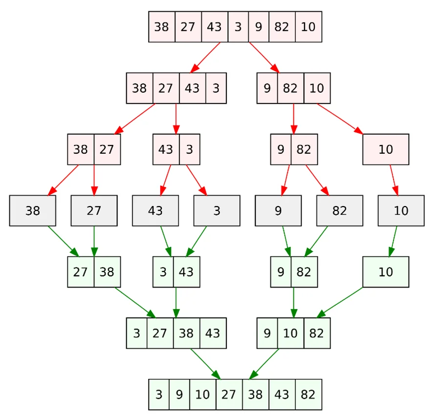

# MergeSort

## Funktionsweise 

- Teile die Datenmenge in zwei möglichst gleich große Hälften    
- Wiederhole diesen Schritt, bis die Teilbereiche nur noch ein Element enthalten
- Führe nun die einzelnen Teilbereiche schrittweise wieder zusammen ("mergen") und sortiere sie dabei



## Pseudocode 

```
funktion Mergesort(A)
    Wenn A.länge >= 2
        m := abrunden((A.länge + 1) / 2)
        links := neue Liste
        rechts := neue Liste
        Für alle i von 1 bis m
            links.einfügen(A.extrahiere_vorderstes())
        Solange A nicht leer ist
            rechts.einfügen(A.extrahiere_vorderstes())
 
        Mergesort(links)
        Mergesort(rechts)
 
        Solange links nicht leer und rechts nicht leer
            Wenn links.vorderstes ≤ rechts.vorderstes
                A.einfügen(links.extrahiere_vorderstes())
            Sonst
                A.einfügen(rechts.extrahiere_vorderstes())
 
        Solange links nicht leer ist
            A.einfügen(links.extrahiere_vorderstes())
        Solange rechts nicht leer ist
            A.einfügen(rechts.extrahiere_vorderstes())
```

## Zeitkomplexität

- Worst case:     O(n log n) 	
- Average case:   O(n log n) 	
- Best case:      O(n log n) 	

## Speicherkomplexität

- O(n)
- Stabil 

## Vorteile

- Effiziente Laufzeit mit O(n log n) 
- Kann Datenmengen sequenziell durcharbeiten, weswegen auch verkettete Listen sortiert werden können
- Stabiler Sortieralgorithmus
- Gut geeignet für sehr große, extern gespeicherte Datenmengen

## Nachteile

- Es wird ein zusätzlicher Zwischenspeicher in der Größe der eigentlichen Datenmenge benötigt
- Nutzen vorsortierter Daten wird nicht ausgenutzt (keine Verbesserung der Laufzeit)

## Typische Anwendungsfälle

- bei verketteten Listen
- wenn auf einem externen Speicher sortiert werden soll

## Unterschied Quicksort und Mergesort

| Grundlage für den Vergleich | Quick Sort | Merge Sort |
|----------------------------|-------------------------------|--------------------------------------|
| Partition von Elementen im Array | Die Aufteilung erfolgt in einem beliebigen Verhältnis, nicht zwingend in zwei Hälften | Das Array wird immer in zwei Hälften (n/2) geteilt |
| Komplexester Fall | `O(n²)` | `O(n log n)` |
| Funktioniert gut auf | Kleineren Arrays | Arrays jeder Größe |
| Geschwindigkeit der Ausführung | Sehr schnell für kleine Datensätze | Konstante Geschwindigkeit unabhängig von der Größe |
| Zusätzlicher Speicherplatzbedarf | Weniger (In-Place) | Mehr (nicht In-Place) |
| Effizienz | Ineffizient für große Arrays | Effizienter |
| Sortiermethode | Intern | Extern |
| Stabilität | Nicht stabil | Stabil |
| Bevorzugt für | Arrays | Verkettete Listen |
| Ort der Referenz | Gut | Schlecht |
| Große Arbeit | Partitionieren des Arrays in Sub-Arrays vor rekursivem Sortieren | Zusammenführen der rekursiv sortierten Teil-Arrays |
| Teilung des Arrays | Kann unausgeglichen sein (abhängig vom Pivot) | Immer ausgeglichen (Teilung in der Mitte) |
| Methode | In-Place-Sortiermethode | Keine In-Place-Sortiermethode |
| Speicherbedarf | Kein zusätzlicher Speicher notwendig | Temporäres Array in Größe der Eingabe erforderlich |


## Quellen 

- https://www.studysmarter.de/schule/informatik/algorithmen-und-datenstrukturen/mergesort/
- https://algorithmen-lernen.de/mergesort/
- https://msgprogramator.sk/de/merge-sort/
- https://www.geeksforgeeks.org/dsa/quick-sort-vs-merge-sort/
