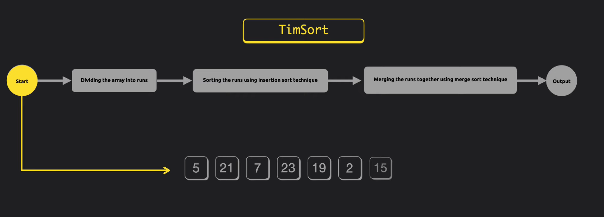
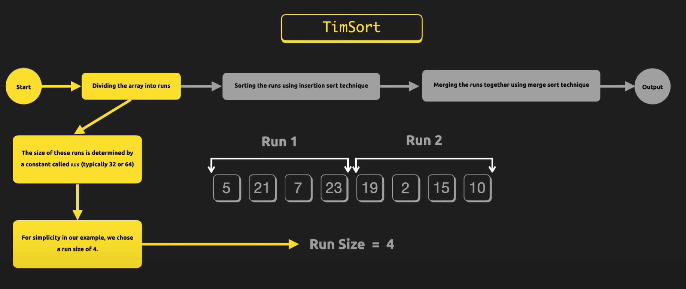
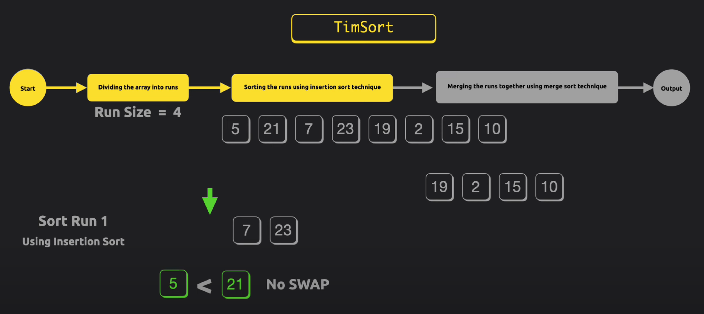
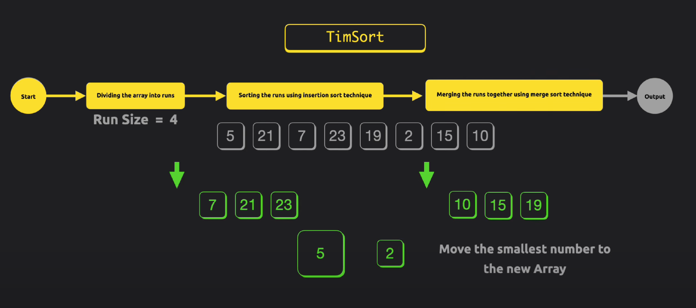
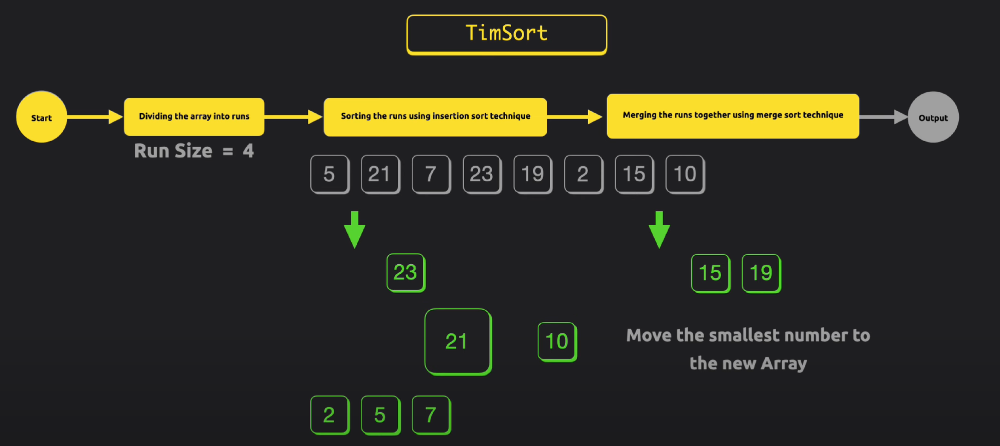
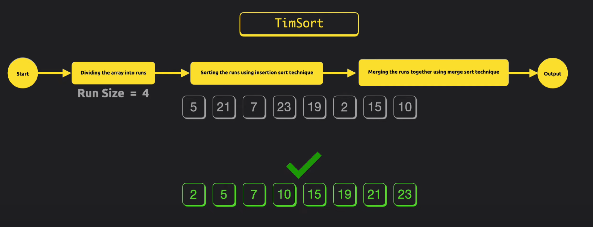
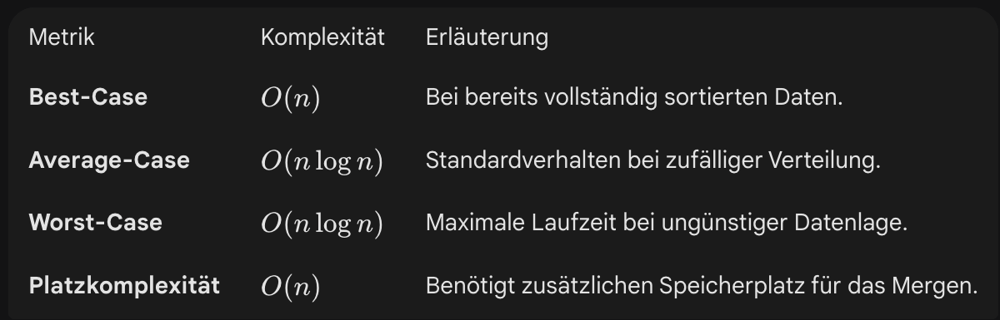

Timsort ist ein schneller, hybrider Sortieralgorithmus, der 2002 von Tim Peters für die Programmiersprache Python entwickelt wurde. Er kombiniert die Stärken von **Merge Sort** und **Insertion Sort**.

---

## Funktionsweise

1. Runs finden: Das Array wird in kleine Abschnitte (Runs) unterteilt.
2. Insertion Sort
3. Merge Sort
4. Galloping Mode: Beim Zusammenführen zweier Runs prüft Timsort, ob ein Run deutlich größere Elemente enthält als der andere. In diesem Fall wechselt er in den "Galloping Mode", um ganze Blöcke statt einzelner Elemente zu überspringen, was den Prozess beschleunigt.

---






---

# Timsort Pseudocode 

```
FUNC Timsort(Liste/Array):

    1. Teile die Liste in kleine Stücke (genannt "Runs").
       Für jeden Run:
       -> Benutze Insertion Sort, um dieses kleine Stück zu sortieren.
       //Jetzt hat man viele sortierte Runs

    2. Füge die Runs paarweise zusammen (Merge Sort):
       -> Nimm Run 1 und Run 2 -> Mische sie zu einem großen Run.
       -> Nimm Run 3 und Run 4 -> Mische sie zu einem großen Run.
       //Wiederhole das, bis am Ende nur noch ein großer, sortierter Run übrig ist.
```

## Komplexität


---

## Vor- und Nachteile

### Vorteile

* **Stabil:** Die relative Reihenfolge gleicher Elemente bleibt erhalten.
* **Adaptiv:** Extrem schnell bei teilweise sortierten Daten (viele reale Datensätze).
* **Effizient:** Übertrifft reines Quicksort oder Mergesort in vielen praktischen Szenarien.

### Nachteile

* **Komplexität:** Schwieriger zu implementieren als einfache Algorithmen.
* **Speicherverbrauch:** Im Gegensatz zu Heap- oder Quicksort benötigt Timsort zusätzlichen Arbeitsspeicher ().

---

## Typische Anwendungsfälle

Da Timsort auf realen Daten extrem performant ist, ist er der Standard-Sortieralgorithmus in vielen modernen Umgebungen:

* **Python:** Standard seit Version 2.3 (`list.sort()`).
* **Java:** Standard für Objektsortierung seit Java 7 (`Arrays.sort()`).
* **Android:** Wird intern für die Sortierung von Listen genutzt.
* **Swift & Rust:** Nutzen Timsort oder Varianten davon (z. B. Pdqsort) für stabile Sortierungen.

---

## Quellen

https://gist.github.com/NightStrang6r/cd88b10faaf1583736cbe0675e09079a

https://youtu.be/3DrYPgmMRbs?si=F3g3poYT00rO0c97

https://www.chrislaux.com/de/timsort
