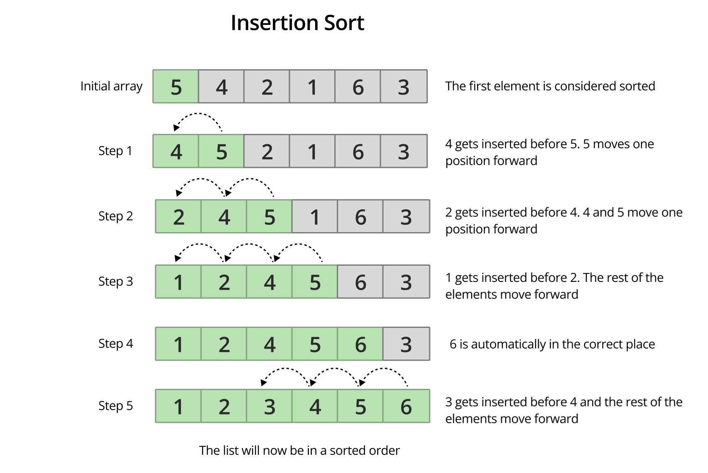

# Insertion sort

## Funktionsweise
- Man unterteilt das Array in zwei Bereiche: sortiert und unsortiert.
- Man sortiert nacheinander jedes Element der unsortierten Liste in die sortierte Liste.

## Beschreibung

- Anwendung bei kleinen Datenmengen
- Speicherkomplexität: $O(1)$ kein weiterer Speicher benötigt -> In-place
- Stabil

## Zeitkomplexität
- Best Case: $O(n)$
- Average Case:  $O(n^2)$
- Worst Case:  $O(n^2)$
  
## Vorteile:
 - simpel und leicht zur implementieren  
 - effizient für kleine und fast sortierte Listen

## Nachteile:
 - ineffizient bei großen Listen
 - hohe Zeitkomplexität

## Pseudocode

1. Starte mit dem zweiten Element der Liste, da man davon ausgeht, dass das erste Element sortiert ist.
2. Vergleiche das 2. Element mit dem 1. Wenn es kleiner ist, tausche die zwei.
3. Schau dir das erste Element der nicht sortierten Liste an (drittes Element), vergleiche es mit der sortierten Liste und setze es an die richtige Position.
4. Wiederhole 3. bis das Array sortiert ist.

```text
Insertionsort (Liste l)
  for a in 0 -> l.length – 2
  do
      b = a + 1
      tmp = l[b]
      while b > 0 AND tmp < l[b-1] do
          l[b] = l[b-1]
          b – –
      l[b] = tmp
```

## Bild zur Darstellung


## Unterschied zu Gnome Sort

| Gnome | Insertion |
|---------|------------|
|tauscht Nachbarn | verschiebt in sortierten Teil|
|weiß nicht wo er weitermachen soll | merkt sich Index des ersten unsortieren Elements|


## Quellen

- [GeeksForGeeks](https://www.geeksforgeeks.org/dsa/insertion-sort-algorithm/)
- [Studyflix](https://studyflix.de/informatik/insertionsort-1321)
- [HappyCoders](https://happycoders.eu/de/alrogithmen/insertion-sort/)
- [Bildquelle](https://mollify.noroff.dev/content/feu2/javascript-2/module-5/algorithms/sorting-and-searching/insertion-sort?nav=)